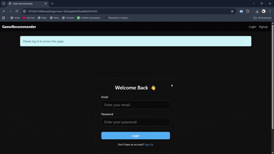
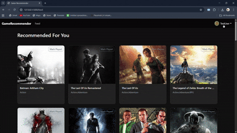
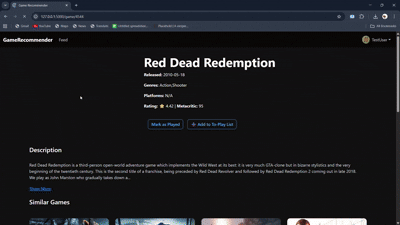

# 🎮 Game Recommender

A personalized **game recommendation web app** built using **Flask, SQLAlchemy, and Bootstrap**.  
The system leverages **clustering-based recommendation logic** to suggest similar games to users based on their preferences.  

---

## 🚀 Features
- 🔍 **Game Search & Details** – Browse games with descriptions, ratings, and release dates.  
- 🤖 **Clustering-based Recommendations** – Suggests similar games using ML-driven clustering.  
- 🗄 **Database Integration** – Powered by PostgreSQL with SQLAlchemy ORM.  
- 🎨 **Responsive UI** – Optimized with Bootstrap, Lighthouse audits, and dark theme support.  
- 🌐 **Deployed with Flask** – Easy to run and extend.  

---

## 📂 Project Structure
```bash
GameRecommender/
│── app/                # Flask application files
│   ├── recommender/    # ML model scripts
│   ├── templates/      # HTML templates
│   ├── static/         # CSS, JS, images
│   ├── routes/         # Flask routes        
│   ├── __init__.py
│   ├── models.py
│   ├── utils.py
│   └── extentions.py
│── run.py 
│── requirements.txt    # Python dependencies
│── README.md           # Project documentation
```

---

## 🛠️ Tech Stack
- **Backend**: Flask, SQLAlchemy  
- **Database**: PostgreSQL  
- **Frontend**: Bootstrap, HTML, CSS  
- **Recommendation Engine**: Clustering (unsupervised ML)  

---

## ⚡ Installation & Setup

1. **Clone the repository**
   ```bash
   git clone https://github.com/Rex1704/GameRecommender.git
   cd GameRecommender
   ```

2. **Create and activate virtual environment**
   ```bash
   python -m venv venv
   source venv/bin/activate   # On Linux/Mac
   venv\Scripts\activate      # On Windows
   ```

3. **Install dependencies**
   ```bash
   pip install -r requirements.txt
   ```

4. **Set up PostgreSQL database**
   - Update `config.py` with your DB credentials.  
   - Run migrations (if applicable).  

5. **Run the app**
   ```bash
   flask run
   ```

6. Open in browser → `http://127.0.0.1:5000/`

---

## ✨ Feature Showcase

### 📰 Personalized Feed
Stay updated with **tailored game recommendations** right on your homepage.  


---

### 🔐 Login & Authentication
Secure login system with **user accounts** to save preferences.  


---

### 🎮 Game Page
Dive deep into **detailed game pages** with descriptions, ratings, and release info.  


---

### 👤 Profile Section
Customize your **profile, preferences, and appearance** for a personal touch.  


---

### 🎶 Playlist Feature
Build your own **game playlists** to track favorites and must-plays.  


---

## 📌 Future Enhancements
- Improve **user authentication** for personalized profiles.  
- Improve recommendation accuracy using **hybrid models**.  
- Deploy on **Render** for public access.  
